<div align="center">

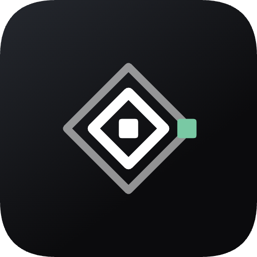

# AlgoDive — Algorithm Visualizer

### Watch algorithms think.

I kept reading algorithm explanations and still not really *seeing* the
algorithm. So I built the thing I wanted.

Sorting, pathfinding and 100 coding problems — watch them happen, then write
the code yourself. It runs and gets graded **on your phone**. No account, no
server, no internet.

[](https://github.com/AhmedAbdoElhawary/flutter-algorithm-visualizer/actions/workflows/ci.yml)
[](LICENSE)
[](https://flutter.dev)
[](https://dart.dev)
[](#platform-support)
[](CONTRIBUTING.md)
[](https://github.com/AhmedAbdoElhawary/flutter-algorithm-visualizer/stargazers)

**Coming soon to the stores**

<!-- TODO once published: replace the two shields below with the official badges.
     App Store  → https://developer.apple.com/app-store/marketing/guidelines/
     Play Store → https://play.google.com/intl/en_us/badges/                     -->


</div>

<p align="center">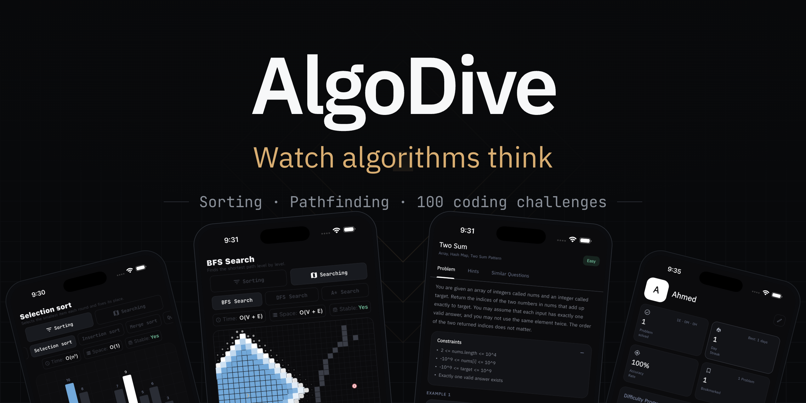</p>

---

## Why I built it

- **🔌 Nothing important needs a network.** Airplane mode, still fully usable.
- **🧠 It actually runs your code.** Hand-written toolchain, grading on-device.
- **🎨 Colors mean something.** A bar is blue because it's *being compared*.
- **🏗️ Built like something I'd ship.** Three flavors, tag-driven releases, 856 tests.

---

## Local/offline first

Your device is the source of truth. The cloud is an optional backup you turn
on if you want it — you never have to make an account.

| Works offline | Needs internet |
| --- | --- |
| Both visualizers | Signing in |
| All 100 problems | Syncing across devices |
| Writing, running and grading code | Crash reports and analytics |
| Streaks, stats, history, bookmarks | |

---

## See it in action

### 🏗️ Three flavors

<table> <tr> <td width="40%" align="center">

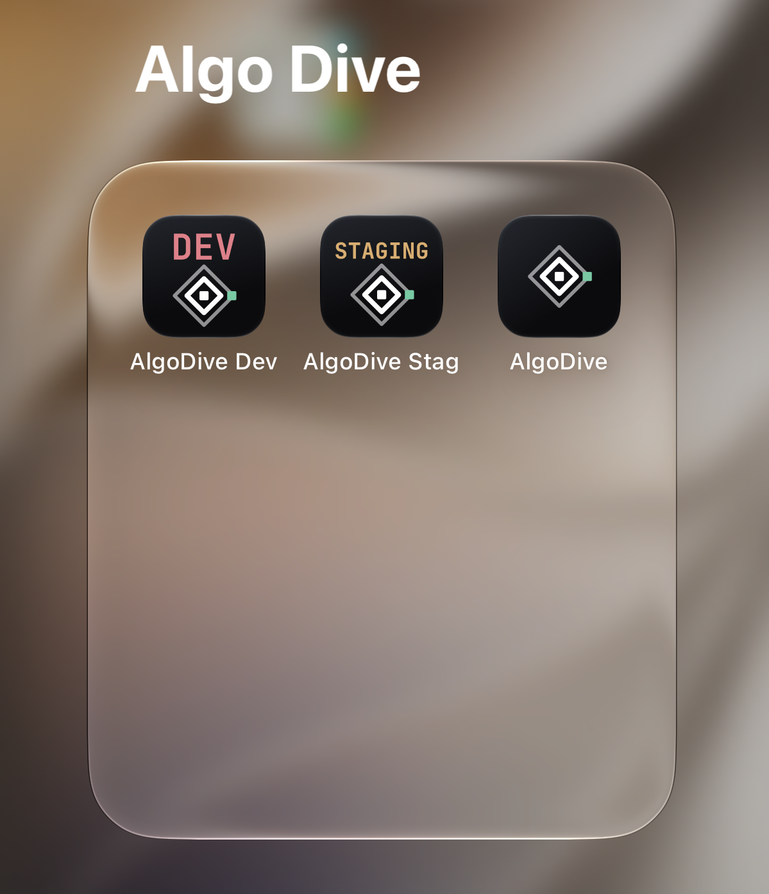

</td> <td width="60%" valign="middle">

`Development` · `Staging` · `Production` — dev and staging carry a ribbon on
the launcher icon, so I always know which build I'm holding.


</td> </tr> </table>

### 🚀 First run

`Onboarding`, `sign-in` (optional — you can skip it), and the `home screen`.

<p align="center">
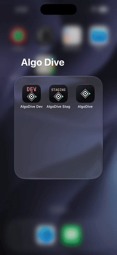
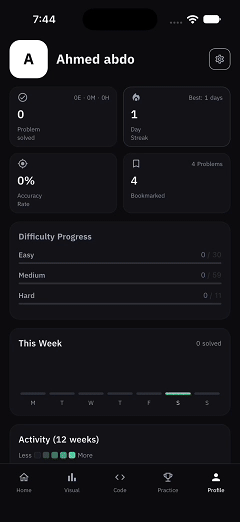
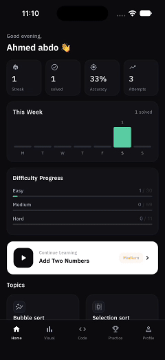
</p>

### 📊 Sorting

`Bubble` · `Selection` · `Insertion` · `Merge` · `Quick` — step by step, with
live complexity read-outs and adjustable speed.

<p align="center">
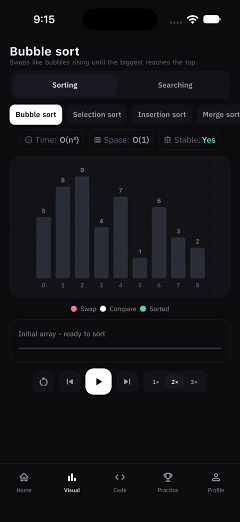
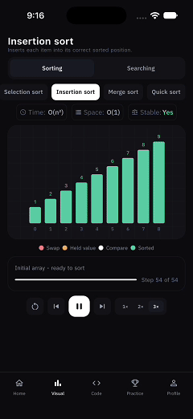
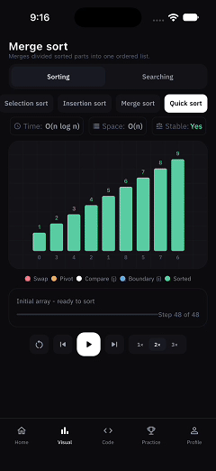
</p>

### 🗺️ Pathfinding

`BFS` · `DFS` · `A*` on a grid you draw walls on with your finger.

<p align="center">
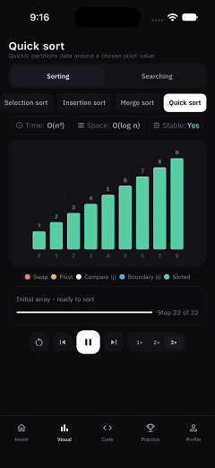
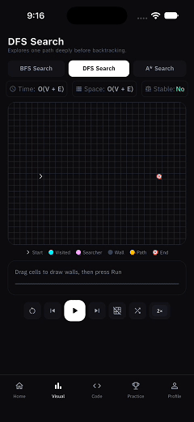
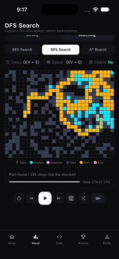
</p>

### 🧩 100 problems

`30 easy`, `59 medium`, `11 hard`. Search, filter by difficulty, bookmark what you
want to come back to.

<p align="center">
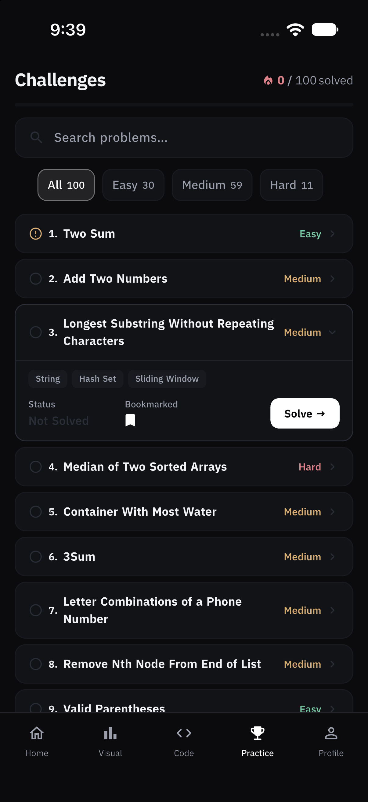
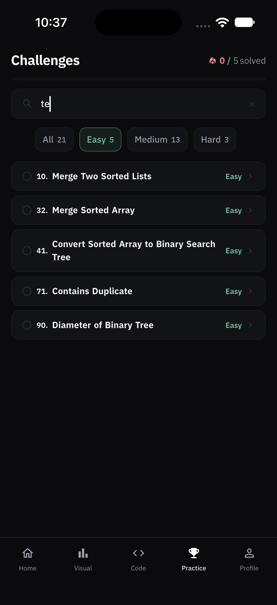
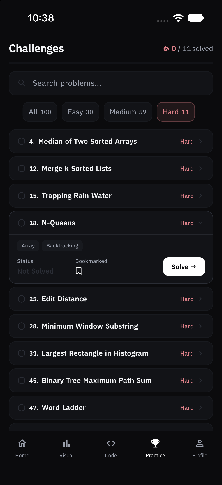
</p>

### ⌨️ Solve it, and the moment it passes

Read the `problem`, write real code in an `editor` I wrote from scratch, and get
graded on-device. No third-party editor package, and the `celebration` is
hand-painted — no confetti library.

<p align="center">
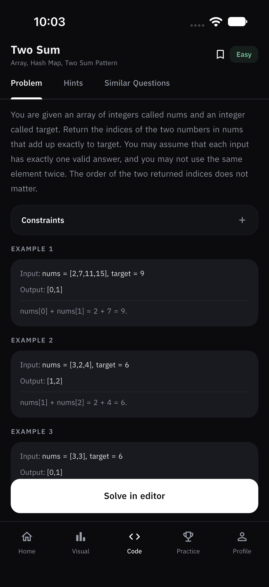
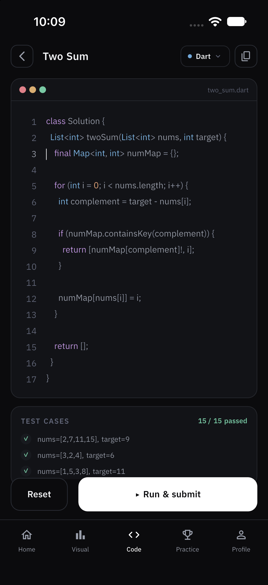
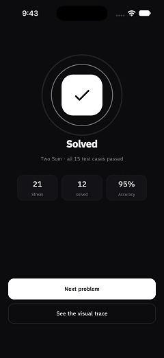
</p>

### 📈 Progress

Contribution-style heatmap, weekly activity, category breakdown and your full
practice history.

<p align="center">
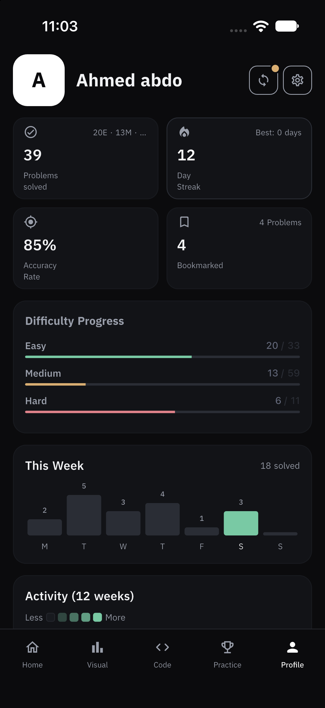
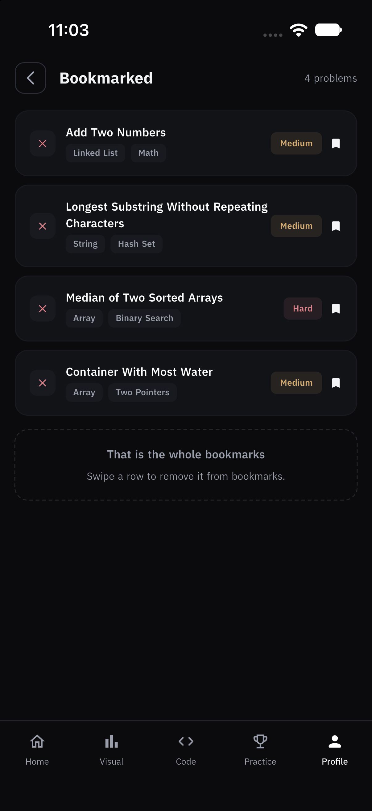
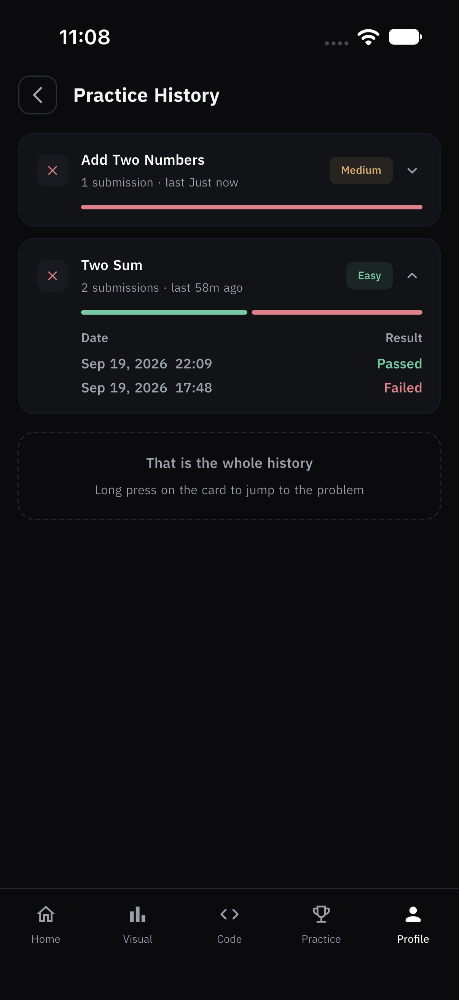
</p>

### ⚙️ Settings & sync

Theme, language, and the sync screen — the one place progress goes to the
cloud, and only when you ask it to.

<p align="center">
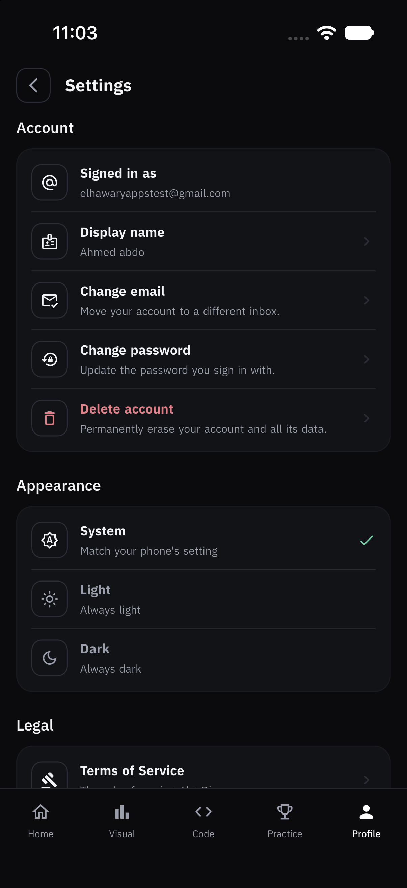
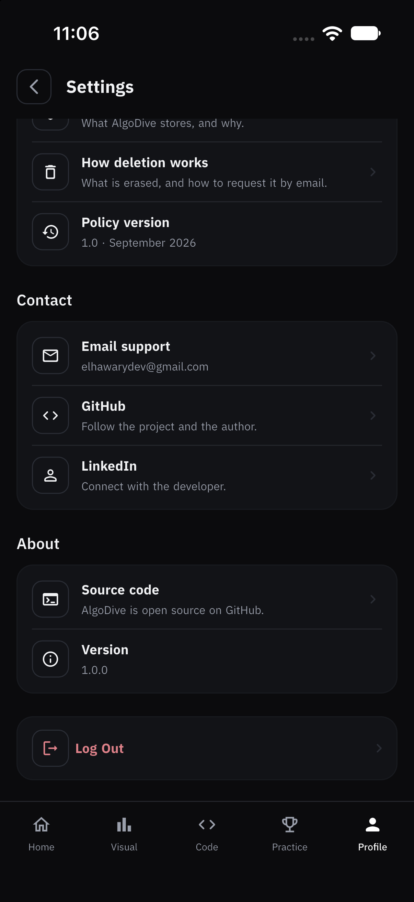
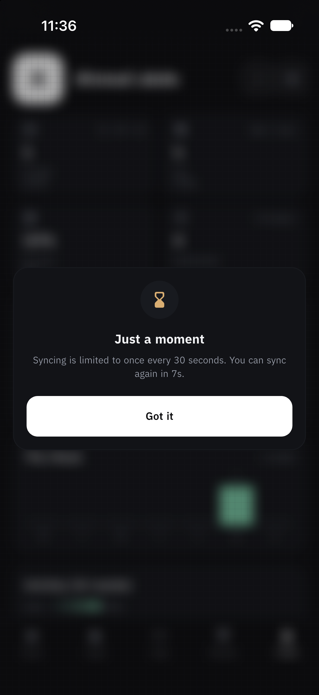
</p>


## Getting started

```bash
git clone https://github.com/AhmedAbdoElhawary/flutter-algorithm-visualizer.git
cd flutter-algorithm-visualizer
flutter pub get
flutter run --flavor dev -t lib/main_dev.dart --dart-define-from-file=dart_define/dev.json
```

One catch: this repo is **public**, so Firebase configs are git-ignored and you
create your own. On Android `android/app/src/dev/google-services.json` is
required or Gradle fails the build. Everything else is optional.

<details>
<summary><b>Config files — how to create each one</b></summary>

| File to create | Required? | What it is |
| --- | --- | --- |
| `android/app/src/dev/google-services.json` | ✅ **Required for Android** | Firebase config. The `google-services` Gradle plugin fails the build without it. |
| `ios/Runner/Firebase/dev/GoogleService-Info.plist` | ✅ Required for iOS | Same, for iOS. A build phase copies it into place per flavor. |
| `dart_define/dev.secret.json` | ➖ Optional | Sentry DSN. Without it, crash reporting is simply off. |
| `android/key.properties` | ➖ Optional | Release signing. Without it, release builds fall back to the debug key. |

#### `google-services.json` — the only required file

1. Open the [Firebase console](https://console.firebase.google.com) → **Add project**
   (call it anything, the free Spark plan is enough).
2. Inside it, click **Add app → Android**.
3. Enter the package name exactly: `com.elhawary.algodive.dev`
4. Download the generated `google-services.json`.
5. Put it at `android/app/src/dev/google-services.json`.

Enable **Authentication → Email/Password** and create a **Cloud Firestore**
database if you want sign-in and cloud sync to work.

> **Why isn't it committed?** It ties the build to *my* Firebase project. Yours
> should point at your own, and a public repo is the wrong place for either.

#### `GoogleService-Info.plist` — iOS only

Same flow, but **Add app → iOS** with bundle id `com.elhawary.algodive.dev`,
saved to `ios/Runner/Firebase/dev/GoogleService-Info.plist`.
`ios/scripts/firebase_config.sh` runs as an Xcode build phase and copies the
right flavor's plist into place automatically.

#### `dart_define/dev.secret.json` — optional

```json
{
  "SENTRY_DSN": "https://<your-key>@o0.ingest.sentry.io/<project>"
}
```

Leave it out and the app runs fine — crash reporting is release-only anyway.
See [`dart_define/README.md`](dart_define/README.md) for why config is split
into committed selectors vs. git-ignored secrets, and why this project
deliberately does **not** use `flutter_dotenv`.

#### `android/key.properties` — optional, release builds only

```properties
storePassword=<your password>
keyPassword=<your password>
keyAlias=upload
storeFile=/absolute/path/to/your/upload-keystore.jks
```

```bash
keytool -genkey -v -keystore ~/upload-keystore.jks \
  -keyalg RSA -keysize 2048 -validity 10000 -alias upload
```

Without this file, `flutter build apk --release` still works — it just falls
back to the debug signing key. **Never commit the keystore or this file.**

</details>

<details>
<summary><b>All three flavors</b></summary>

| Flavor | Entry point | Config | Application ID | Firebase project |
| --- | --- | --- | --- | --- |
| `dev` | `lib/main_dev.dart` | `dart_define/dev.json` | `com.elhawary.algodive.dev` | `algodive-dev` |
| `staging` | `lib/main_staging.dart` | `dart_define/staging.json` | `com.elhawary.algodive.staging` | `algodive-staging` |
| `production` | `lib/main_prod.dart` | `dart_define/prod.json` | `com.elhawary.algodive` | `algodive-prod` |

```bash
flutter run --flavor staging    -t lib/main_staging.dart --dart-define-from-file=dart_define/staging.json
flutter run --flavor production -t lib/main_prod.dart    --dart-define-from-file=dart_define/prod.json
```

Dev and staging installs carry a **ribbon on the launcher icon**, so you always
know which build you're holding. VS Code and Android Studio run configurations
are committed too — press **F5** and pick `dev (debug)`.

</details>

<details>
<summary><b>Something went wrong?</b></summary>

| Symptom | Cause | Fix |
| --- | --- | --- |
| `File google-services.json is missing` | Config step skipped | Create `android/app/src/dev/google-services.json` |
| `No matching client found for package name` | Package name typo in Firebase | It must be exactly `com.elhawary.algodive.dev` |
| `FlavorConfig has not been initialized` | Ran without `--dart-define-from-file` | Use the full run command above |
| `Flavor 'dev' is not supported` | Missing `--flavor dev` | Flavor **and** entry point are both required |
| Sign-in fails, everything else works | Firebase Auth not enabled | Enable Email/Password in the Firebase console |

</details>

---

## Under the hood

<details open>
<summary><b>Project structure</b></summary>

```
lib/
├── config/
│   └── routes/
│   └── themes/
├── core/
│   ├── flavor/
│   ├── monitoring/
│   ├── widgets/
│   ├── custom_packages/
│   │   └── custom_code_editor/
│   ├── resources/
│   └── storage/
│   └── exceptions/
└── features/
    ├── visualize/
    ├── challenge/
    │   └── data/
    │   └── domain/
    │   └── presentation/
    ├── auth/
    ├── home/
    │   └── view/
    │   └── view_model/
```

Feature-based, with full clean-architecture layering on the mature slices and a
lighter MVVM shape on the simpler ones.

</details>

**76 test files · 856 tests · 179 groups.**

```bash
flutter test --dart-define-from-file=dart_define/dev.json
```

> 📐 **Why it's built this way** — decisions, trade-offs, and what I'd do
> differently — lives in [Engineering_Decision.md](Engineering_Decision.md).

---

## Roadmap

**✅ Live** — Sorting (5) · Pathfinding (3) · 100 problems with on-device grading

| Planned | |
|---|---|
| **Sorting** | Heap · Shell · Radix · Counting · Bucket |
| **Graphs** | Dijkstra · Bellman-Ford · Topological sort |
| **Mazes** | Recursive division · Kruskal · Eller's · Aldous-Broder · Binary tree |
| **Trees** | BST · AVL · Red-Black · Segment tree · B-Tree |
| **Linked lists** | Singly · Doubly · Circular |
| **Later** | Dynamic programming · String algorithms · side-by-side comparison |

---

## Platform support

Android and iOS. Android is fully wired for release; iOS builds in CI as an
unsigned smoke test while I finish setting up signing. Web and desktop aren't
ruled out, just not a priority.

---

## Contributing

Welcome — especially **new algorithms**.

Easiest first PR: **Heap, Shell, Radix, Counting and Bucket** sorts are already
written and tested but not reachable in the UI. The hard part is done; what's
missing is the card and the wiring. See
**[CONTRIBUTING.md](CONTRIBUTING.md)** for the walkthrough.

- 🐛 [Report a bug](https://github.com/AhmedAbdoElhawary/flutter-algorithm-visualizer/issues/new?template=bug_report.yml)
- 💡 [Request a feature](https://github.com/AhmedAbdoElhawary/flutter-algorithm-visualizer/issues/new?template=feature_request.yml)
- 🧮 [Request an algorithm](https://github.com/AhmedAbdoElhawary/flutter-algorithm-visualizer/issues/new?template=algorithm_request.yml)
- 🔒 [Security policy](SECURITY.md) · 🤝 [Code of conduct](CODE_OF_CONDUCT.md)

---

## Keep in touch

💼 [LinkedIn](https://www.linkedin.com/in/ahmedabdoelhawary) ·
📧 [elhawarydev@gmail.com](mailto:elhawarydev@gmail.com) ·
🐙 [GitHub](https://github.com/AhmedAbdoElhawary) ·
💬 [Discussions](https://github.com/AhmedAbdoElhawary/flutter-algorithm-visualizer/discussions)
